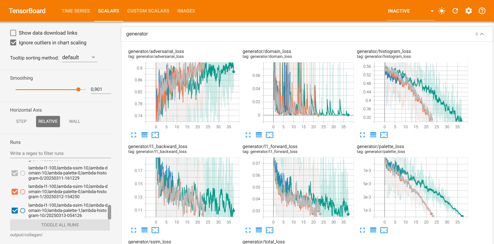

# Multi-Domain Pixel Art Character Generation using GANs

This is the source code repository where I research training of
generative adversarial network models to produce pixel art characters
in target positions given one or more images of them facing source ones.

There are different models we propose and evaluate in this repository, such as
those based on StarGAN, CollaGAN, and others. The models are trained and evaluated
using datasets of pixel art characters in different poses: back, left, front, and right.

---

## Requirements and Installation

The project was developed using Python 3.9 and Tensorflow 2.18.0. To install the required packages, run:

```bash
python -m venv venv
pip install -r requirements.txt
```

The datasets are included in the `datasets` folder in compressed format. They are automatically extracted when the
training code is run for the first time.


---

## How to Train

The script [`train.py`](train.py) is used to train the model. It has several command-line arguments to configure the training
procedure, such as the dataset to use, the number of epochs, the batch size, and the learning rate. A typical execution:

```bash
python train.py collagan --rm2k --steps=40000 --no-tran --lambda-l1 100 --lambda-domain 10 --lambda-ssim 10 --lr 0.0001
```

The full list of arguments is given by the following table, with `model` being the only required positional
argument:

| Parameter                         | Type        |                          Default | Description                                                                                                                                                                                      |
|-----------------------------------|-------------|---------------------------------:|--------------------------------------------------------------------------------------------------------------------------------------------------------------------------------------------------|
| `model`                           | `str`       |                                  | The name of the model to use. Can be one from {stargan-unpaired, stargan-paired, collagan, munit, remic, yamatagan}                                                                              |
| `--generator`                     | `str`       |                                  | The type of the generator to use. Depends on the `model`: StarGAN is always {resnet}, CollaGAN can be {affluent (default), palette}, remic is always {remic}, yamata is always {yamata}          |
| `--conditional-discriminator`     | `str`       |                            False | If the discriminator should be conditioned on the generator's source image (such as in Pix2Pix). Used by StarGAN                                                                                 |
| `--source-domain-aware-generator` | `str`       |                            False | If the generator should be aware of the source domain as an input. Used by StarGAN                                                                                                               |
| `--discriminator-scales`          | `int`       |                                3 | The number of scales of the discriminator used by MUNIT and ReMIC                                                                                                                                |
| `--annealing`                     | `str`       |                            False | How to decrease the temperature when training models that quantize the generated images to their palettes (CollaGAN). One from {none, linear}                                                    |
| `--temperature`                   | `float`     |                                1 | The initial temperature when training models that quantize the generated images to their palettes (CollaGAN)                                                                                     |
| `--lr`                            | `float`     |                           0.0001 | The initial learning rate                                                                                                                                                                        |
| `--lr-decay`                      | `str`       |             constant-then-linear | The type of decay for the learning rate. One from {none, constant-then-linear}                                                                                                                   |
| `--batch`                         | `int`       |                                4 | Number of examples in each batch                                                                                                                                                                 |
| `--steps`                         | `int`       |                            10000 | Number of steps to update the generator when training (epochs will be calculated from this. Provide only one)                                                                                    |
| `--epochs`                        | `int`       |                                0 | Number of epochs to train (steps will be calculated from this. Provide only one)                                                                                                                 |
| `--evaluate-steps`                | `int`       |                             1000 | At which interval to pause training and show a preview with freshly generated images                                                                                                             |
| `--pretrain-epochs`               | `int`       |                                0 | NOT USED. Number of epochs to pretrain the generator before training the discriminator                                                                                                           |
| `--domains`                       | `list[str]` | "back", "left", "front", "right" | Names of the domains related to the problem at hand. Should match the folders inside the dataset directory, with an additional number before it, starting with 0 (e.g., "0-back", "1-left" etc.) |
| `--image-size`                    | `int`       |                               64 | Width and height of the input and output images                                                                                                                                                  |
| `--output-channels`               | `int`       |                                4 | Number of channels of the output images                                                                                                                                                          |
| `--input-channels`                | `int`       |                                4 | Number of channels of the input images                                                                                                                                                           |
| `--verbose`                       | `bool`      |                            False | If additional information should be displayed                                                                                                                                                    |
| `--lambda-l1`                     | `float`     |                              100 | Value for λreg used for the image generated in the forward step (all models except unpaired ones)                                                                                                |
| `--lambda-l1-backward`            | `float`     |                               10 | Value for λmcyc (cyclic) for the images reconstructed in the backward step (CollaGAN)                                                                                                            |
| `--lambda-gp`                     | `float`     |                               10 | Value for λgradient-penalty for the Wasserstein Loss in StarGAN                                                                                                                                  |
| `--lambda-domain`                 | `float`     |                               10 | Value for λdomain in the loss function(CollaGAN, StarGAN)                                                                                                                                        |
| `--lambda-ssim`                   | `float`     |                               10 | Value for λssim in the loss function (CollaGAN)                                                                                                                                                  |
| `--lambda-tv`                     | `float`     |                                0 | Value for λtv in the loss function - total variation (StarGAN)                                                                                                                                   |
| `--lambda-latent-reconstruction`  | `float`     |                                1 | Value for λlatent in the loss function - latent reconstruction (MUNIT, ReMIC)                                                                                                                    |
| `--lambda-cyclic-reconstruction`  | `float`     |                                0 | Value for λcyclic in the loss function - cyclic reconstruction (MUNIT, ReMIC)                                                                                                                    |
| `--lambda-palette`                | `float`     |                                0 | Value for λpalette in the loss function - palette reconstruction (StarGAN, CollaGAN)                                                                                                             |
| `--lambda-histogram`              | `float`     |                                0 | Value for λhistogram in the loss function - histogram matching (CollaGAN)                                                                                                                        |
| `-d-steps`                        | `int`       |                                1 | Number of steps to update the discriminator when training (unpaired StarGAN)                                                                                                                     |
| `--no-aug`                        | `bool`      |                            False | Prevents the use of any data augmentation technique                                                                                                                                              |
| `--no-hue`                        | `bool`      |                            False | Prevents hue rotation as augmentation, but maybe allow translation                                                                                                                               |
| `--no-tran`                       | `bool`      |                            False | Prevents translation as augmentation, but maybe allow hue rotation                                                                                                                               |
| `--sampler`                       | `str`       |                     multi-target | The type of sampler to use for StarGAN from {multi-target, single-target}                                                                                                                        |
| `--capacity`                      | `int`       |                                4 | The multiplier to the number of filters in each layer of the generator                                                                                                                           |
| `--input-dropout`                 | `str`       |                             none | Applies dropout to the input as in the CollaGAN paper. Can be one from {none, original, curriculum, conservative (default)}                                                                      |
| `--cycled-source-replacer`        | `str`       |                          dropout | One from {dropout, forward (default)} indicating which images should be replaced by the forward generated one when computing the cycled images                                                   |
| `--callback-debug-discriminator`  | `bool`      |                            False | If we should see discriminator output during training at every `evaluate_steps`                                                                                                                  |
| `--callback-evaluate-fid`         | `bool`      |                            False | If the FID should be evaluated at every `evaluate_steps`                                                                                                                                         |
| `--callback-evaluate-l1`          | `bool`      |                            False | If the L1 loss should be evaluated at every `evaluate_steps`                                                                                                                                     |
| `--save-model`                    | `bool`      |                            False | If the model should be saved at the end of training                                                                                                                                              |
| `--rmxp`                          | `bool`      |                            False | Uses RPG Maker XP dataset                                                                                                                                                                        |
| `--rm2k`                          | `bool`      |                            False | Uses RPG Maker 2000 dataset                                                                                                                                                                      |
| `--rmvx`                          | `bool`      |                            False | Uses RPG Maker VX Ace dataset                                                                                                                                                                    |
| `--tiny`                          | `bool`      |                            False | Uses Tiny Hero dataset                                                                                                                                                                           |
| `--misc`                          | `bool`      |                            False | Uses the miscellaneous sprites dataset                                                                                                                                                           |
| `--rmxp-validation`               | `bool`      |                            False | Uses the RPG Maker XP dataset for validation instead of the test partition of the training datasets                                                                                              |
| `--rm2k-validation`               | `bool`      |                            False | Uses the RPG Maker 2000 dataset for validation instead of the test partition of the training datasets                                                                                            |
| `--rmvx-validation`               | `bool`      |                            False | Uses the RPG Maker VX Ace dataset for validation instead of the test partition of the training datasets                                                                                          |
| `--tiny-validation`               | `bool`      |                            False | Uses the Tiny Hero dataset for validation instead of the test partition of the training datasets                                                                                                 |

The training script creates a timestamped folder inside the `output` directory. It stores from configuration files to
previews of the generated images.

At every 1,000 steps (or the provided `--evaluate-steps`), the script will produce a preview of the
generated images and optionally run some callbacks: evaluate using FID (`--callback-evaluate-fid`), evaluate using 
L1 distance (`--callback-evaluate-l1`), or producing images with the discriminator output 
(`--callback-debug-discriminator`). The preview image is saved in the `output` folder, under a timestamped directory.

During training, if you want to see how the evaluation and training metrics are evolving, you can open tensorboard 
pointing to the output directory using:

```bash
tensorboard --logdir output --load_fast false
```


When training ends, the script saves the model weights in the `saved-model` folder, as well as the configuration used 
in the training. It also saves the images generated at the end from the whole test set in the `test-images` folder.

---
## Code Organization

The code is organized in the following way:
- [`train.py`](train.py): Script to train a model with a specific configuration
  - According to the configuration provided as command line arguments, it creates the model, the dataset loader, 
    and executes the training loop
- `configuration.py`: Defines the hyperparameters and configurations for the models
  - Look it up if you want to track how some specific hyperparameter is used throught the models
  - Change it if you want to add a new hyperparameter or change the default value of one
- `setup.py`: Downloads and/or unzips the datasets to the `datasets` folder
    - It is executed when the training script is run for the first time. No need to run it manually
- Model files (folder [models](models)):
  - `side2side_model.py`: Base class for all multi-domain models to extend. Abstract methods:
    - `create_training_only_networks()`: Creates the discriminator(s) of the respective model
    - `create_inference_networks()`: Creates the generator(s) of the respective model
    - `train_step(batch, step, update_steps, t)`: Trains the model for one step
    - `select_examples_for_visualization(train_ds, test_ds)`: Selects examples to visualize during training
    - `preview_generated_images_during_training(examples, save_name, step)`: Generates and saves images during training
    - `initialize_random_examples_for_evaluation(train_ds, test_ds, num_images)`: Initializes indices of examples
      for evaluation
    - `generate_images_for_evaluation(example_indices_for_evaluation)`: Generates images for evaluation
      at every evaluation loop
    - `generate_images_from_dataset(dataset, step, number_of_images)`: Generates images from the test partition
      at the end of training
    - `debug_discriminator_output(batch, image_path)`: Creates an image with the discriminator output for debugging
  - [`star_model.py`](models/star_model.py): Implementation of the StarGAN model (unpaired (original) and paired StarGAN)
  - [`colla_model.py`](models/colla_model.py): Implementation of the CollaGAN model
  - [`munit_model.py`](models/munit_model.py): Implementation of the MUNIT model
  - [`remic_model.py`](models/remic_model.py): Implementation of the ReMIC model
  - [`yamata_model.py`](models/yamata_model.py): Implementation of the YamataGAN model
  - `networks.py`: Network topologies for the generator and discriminator of all models
- Utility scripts (folder [utility](utility)):
  - `dataset_utils.py`: Loads the datasets and preprocesses the images
        - It also contains the data augmentation techniques used during training
  - `keras_utils.py`: Contains utility functions to create the models and the loss functions
  - `palette_utils.py`: Contains utility functions to extract the palettes of the images
  - `io_utils.py`: Contains utility functions related to image representation and string output
  - `functional_utils.py`: Contains utility functions to make programming more like the functional paradigm
  - `histogram_utils.py`: Contains utility functions to compute the histograms of the images and histogram matching loss
  - `frechet_inception_distance.py`: Contains the code to compute the FID metric
- Regarding experiments (hyperparameter selection etc.):
  - `experiment_runner.py`: Class to run experiments with different models and configurations
  - `experiment_***.py`: Scripts to run specific experiments. They can be run as scripts, like `./experiment_***.py`

- --
## Running Experiments

Training a model with an already known set of hyperparameters can be done in the command line, executing 
[`train.py`](train.py) directly while providing the desired arguments. However, when we want to run multiple 
experiments with different  hyperparameters, it is better to use `Experimenter` class from 
[`experiment_runner.py`](experiment_runner.py).

Let's look into the example of finding the best lambda weights for the paired StarGAN's cost function, defined in
`experiment_stargan_paired_cost.py`:

```python
#!/usr/bin/env python3
import sys

from experiment_runner import Experimenter, create_general_parser

if __name__ == "__main__":
    config = create_general_parser(sys.argv[1:])

    runner = Experimenter(
        "train" if not config.dummy else "dummy_script",
        config.python,
        {
            "model": "stargan-paired",
            "adhoc": [
                "callback-evaluate-l1",
                "conditional-discriminator", "source-domain-aware-generator",
                "save-model"
            ],
            "log-folder": config.output if config.output is not None else "output",
            "steps": 80000,
            "evaluate-steps": 1000,
            "d-steps": 1,
            "lr": 0.0002,
            "sampler": "multi-target",
            "model-name": "@model",
            "experiment": "@dataset,&lambda-l1,&lambda-domain,&lambda-reconstruction&capacity",
        }, {
            "lambda-l1": [100.],
            "lambda-domain": [10., 1.],
            "lambda-reconstruction": [10., 100.],
            "capacity": [4, 2, 1],
        }, {
            "tiny": {
                "adhoc": ["no-aug"]
            },
            "rm2k": {
                "adhoc": ["no-tran"]
            },
            "rmxp": {
                "adhoc": []
            },
            "rmvx": {
                "adhoc": ["no-tran"]
            },
            "all": {
                "adhoc": ["no-tran"],
                "steps": 80000
            }
        })
    runner.execute(config)
```

The `Experimenter` class constructor expects the following parameters:
1. `script_to_run`: The name of the script to run. If `dummy_script` is provided, it will only print the commands to be
   executed without running them
2. `path_to_python`: The path to the Python interpreter to use. Usually just `python` or `python3`
3. `default_params`: The default configuration to be used in the experiments. It is a dictionary that can contain all:
   the configuration parameters that can be passed to the `train.py` script, such as:
   - `model`: The name of the model to use
   - `adhoc`: A list of boolean arguments (e.g., `--callback-evaluate-fid`, `--rmxp`) to be passed to the
     training script
   - `log-folder`: The folder where the logs will be saved
   - `steps`: The number of steps to train the model
   - `evaluate-steps`: The interval to evaluate the model
   - `lr`: The learning rate
   - `sampler`: The type of sampler to use
   - `model-name`: The name of the model to be used in the experiment
   - `experiment`: The experiment string to be used in the experiment
     - The strings `&name` and `@name` will be replaced by the values either in the `default_params` or in the 
     - `search_grid` dictionaries
       - `@name` replaces by the value: `@model` -> `stargan-paired`
       - `&name` replaces by name and value: `&lambda-l1` -> `lambda-l1=100`
     - The `@dataset` resolves to the dataset used in the experiment
4. `search_grid`: A dictionary of hyperparameter names and list of values to sweep. In this example, we want to train
   paired StarGAN models that have the following hyperparameters:
    - `lambda-l1`: [100.] (only one value)
    - `lambda-domain`: [10., 1.]
    - `lambda-reconstruction`: [10., 100.],
    - `capacity`: [4, 2, 1] (total of 1x2x2x3 = 12 experiments)
5. `dataset_params`: Optional dict of hyperparameters that are specific to each dataset
